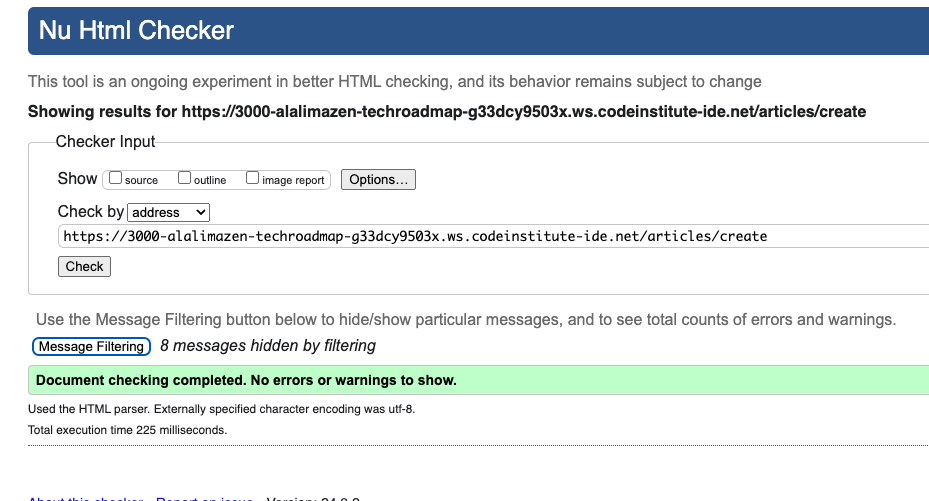
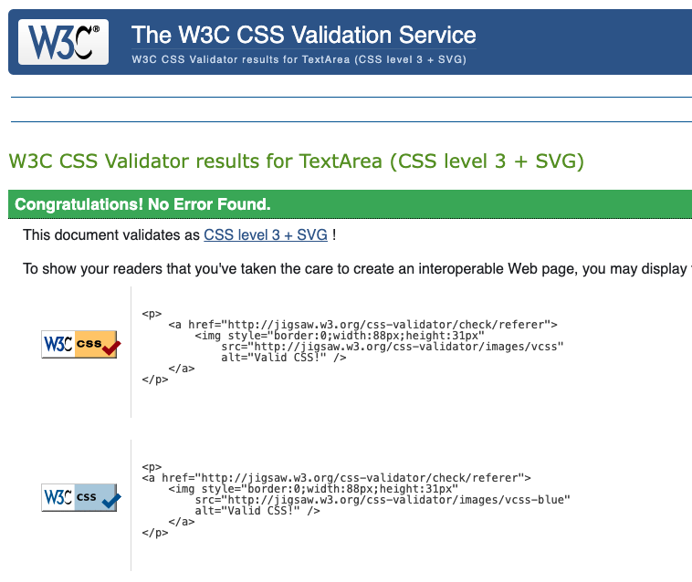
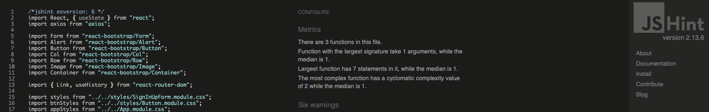
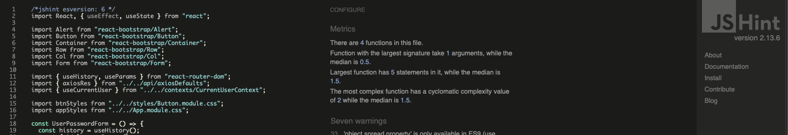
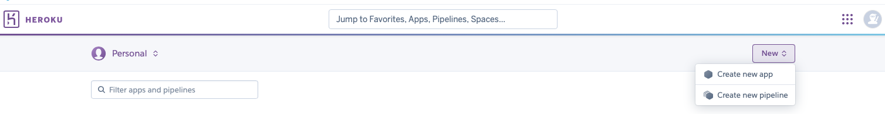
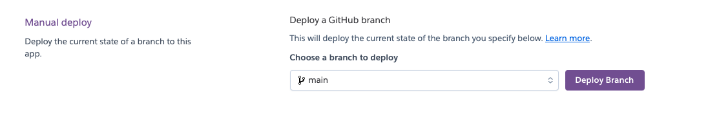

# Tech-Roadmap

Tech-Roadmap is a cutting-edge web platform built to bridge the gap between social interaction and educational growth in the technology sector. Developed with React on the front end and backed by Tech-Roadmap-DRF, the Django REST Framework-based API, this project delivers a seamless user experience that caters to both tech enthusiasts and learners alike.

The primary goal of Tech-Roadmap is to create an interactive space where users can engage in two distinct ways. First, users can post short updates, thoughts, or tips on any tech-related topic—much like you would on Facebook—creating an ongoing exchange of ideas and insights within the community. This social aspect fosters collaboration and knowledge sharing among developers, learners, and tech professionals.

Second, Tech-Roadmap offers a course enrollment feature that mirrors platforms like Udemy. Users can browse through a wide variety of technology-focused courses, enroll in those that interest them, and further their skills in programming, development, and more. Whether you're a beginner looking to learn new tech skills or a seasoned professional sharing your expertise, Tech-Roadmap is designed to support both learning and collaboration.

By combining social interaction with education, the platform aims to empower users to explore new technologies, share their knowledge, and grow within the tech community. Whether you’re here to share, learn, or both, Tech-Roadmap provides a unique space to achieve your goals.

This Front End website makes use of the backend Django-Rest-Framework project which has the following repository [Tech-Roadmap-DRF](https://github.com/AlAliMazen/Tech-Roadmap-DRF) as a source code and the [Tech-Roadmap-DRF](https://tech-roadmap-drf-6a7361986bbb.herokuapp.com/) as deployed version. 

The following screen shot is done by [am-I-responsive](https://ui.dev/amiresponsive)

## Live Website 
[Tech-Roadmap](https://tech-roadmap-73a10d63ed32.herokuapp.com)

## Tech-Roadmap Repository
[Tech-Roadmap-Repo](https://github.com/AlAliMazen/tech-roadmap)

## Live Backend API 
[Tech-Roadmap-Live-API](https://tech-roadmap-drf-6a7361986bbb.herokuapp.com/)

## Backend API Repository
[Tech-Roadmap-DRF-Repo](https://github.com/AlAliMazen/Tech-Roadmap-DRF)

## Author

MAZEN AL ALI

- [Tech-Roadmap](#tech-roadmap)
  * [Live Website](#live-website)
  * [Tech-Roadmap Repository](#tech-roadmap-repository)
  * [Live Backend API](#live-backend-api)
  * [Backend API Repository](#backend-api-repository)
  * [Author](#author)
- [How it works](#how-it-works)
- [UX](#ux)
  * [Target Audience](#target-audience)
    + [Junior Programmers:](#junior-programmers-)
    + [Visitors Interested in IT and Technology](#visitors-interested-in-it-and-technology)
    + [Management and Entrepreneurs](#management-and-entrepreneurs)
  * [Goals](#goals)
  * [Scope (DONE)](#scope--done-)
  * [Design Choices](#design-choices)
    + [Colors](#colors)
    + [Typography](#typography)
    + [Design Elements](#design-elements)
    + [Animations and Transitions](#animations-and-transitions)
    + [Frameworks](#frameworks)
    + [Custom Styles](#custom-styles)
    + [Custom Javascript](#custom-javascript)
  * [Wireframes](#wireframes)
    + [Wireframes Overview](#wireframes-overview)
- [Information Architecture](#information-architecture)
  * [Entity Relationship Diagram](#entity-relationship-diagram)
  * [Database Choice](#database-choice)
    + [Why PostgreSQL (Advantages)](#why-postgresql--advantages-)
  * [Data Models](#data-models)
- [Agile Process](#agile-process)
  * [GitHub User Stories](#github-user-stories)
    + [User Story Templates](#user-story-templates)
    + [User Stories Overview](#user-stories-overview)
    + [Epic Stories](#epic-stories)
    + [Normal User Stories](#normal-user-stories)
- [Features](#features)
    + [1. **Navigation Bar**](#1---navigation-bar--)
    + [2. **Sign-Up and Logout**](#2---sign-up-and-logout--)
    + [3. **Home Page**](#3---home-page--)
    + [4. **Article Comments**](#4---article-comments--)
    + [5. **Course Enrollment**](#5---course-enrollment--)
    + [6. **Course Reviews and Ratings**](#6---course-reviews-and-ratings--)
    + [7. **Most Followed Profiles**](#7---most-followed-profiles--)
    + [8. **Profile Pages**](#8---profile-pages--)
    + [9. **No Result Page**](#9---no-result-page--)
    + [10. **Filtering**](#10---filtering--)
    + [11. **Write Reviews**](#11---write-reviews--)
  * [Future Features](#future-features)
    + [Future Features](#future-features-1)
- [Testing (Still to do)](#testing--still-to-do-)
  * [Cross Browser and Cross Device Testing](#cross-browser-and-cross-device-testing)
  * [Why Choosing the pre-defined Browsers](#why-choosing-the-pre-defined-browsers)
  * [Accessibility Testing](#accessibility-testing)
  * [Validation Testing](#validation-testing)
    + [HTML Validation:](#html-validation-)
    + [CSS Validation:](#css-validation-)
    + [JS Code Validation](#js-code-validation)
    + [Python Code Validation](#python-code-validation)
    + [JSON Code Validation](#json-code-validation)
  * [Manual Test](#manual-test)
  * [Defects](#defects)
  * [Defects of Note](#defects-of-note)
    + [Outstanding Defects](#outstanding-defects)
  * [Development Deployment](#development-deployment)
  * [Production Deployment](#production-deployment)
    + [Pre-Requisties](#pre-requisties)
    + [How to Connect your IDE to the API?](#how-to-connect-your-ide-to-the-api-)
    + [When it is READY](#when-it-is-ready)
- [Credits](#credits)
  * [Code and Content](#code-and-content)
  * [Media](#media)
  * [Acknowledgments](#acknowledgments)

<small><i><a href='http://ecotrust-canada.github.io/markdown-toc/'>Table of contents generated with markdown-toc</a></i></small>

# How it works
For adding an article, you need to simply to sign up for a free account and sign in using your creddentials. When your are logged in, you can head to the **Add Article** in the Naviagation bar. Fill out the required information and click on save. Now you have your first article published to the public to interact with. **In case you didn't find the suitable Category for it, you can go to the [Add Categroy] also in the navigation bar and add your own category which is going to be also available for the public**

# UX

Your site is most likely geared to a certain audience and goals for the business owner and users of the site, and your design choices should tie into them. Let the assessors know your thought process.

## Target Audience

Targeted Audience
Tech-Roadmap is designed to cater to three main groups, each with unique goals and interests. By providing both technical and social features, the platform serves as a versatile space for learning, sharing, and growing in the tech world.

### Junior Programmers:
The first group is junior developers who are eager to learn and explore the connection between front-end and back-end development. For these users, Tech-Roadmap serves as a practical example of how to integrate modern front-end frameworks like React with a back-end powered by Django REST Framework (DRF). This audience can dig into the codebase, analyze how different components are styled and implemented, and gain valuable hands-on experience in full-stack development. It’s an excellent opportunity for aspiring programmers to see how real-world applications are structured and maintained.

### Visitors Interested in IT and Technology
The second group consists of general visitors who are passionate about IT and technology but may not have a deep programming background. For them, Tech-Roadmap functions as a social platform where they can read engaging posts, stay updated on the latest tech trends, and gain insights into various IT topics. More importantly, these users can also enroll in technology-related courses that align with their interests, similar to popular platforms like Udemy. Whether they want to upskill or just stay informed, this group finds value in both the content shared by the community and the educational resources available on the platform.

### Management and Entrepreneurs
The final group includes management teams or entrepreneurs who are focused on building and scaling social platforms. Tech-Roadmap offers a blueprint for creating a social network that combines educational features with user interaction. This group can observe how a platform can start small, focusing on a niche audience—like the tech and IT community—and grow step by step. For those interested in launching their own social platform, Tech-Roadmap provides an excellent model for combining user engagement, social sharing, and educational content in a scalable way.

## Goals

Tech-Roadmap is designed to meet the needs of three key groups, each with distinct goals and interests. The platform offers a blend of technical education, social engagement, and scalability, as well as reusability making it a valuable resource for junior programmers, tech enthusiasts, and management teams.

1. **Junior Programmers**  
   - Gain hands-on experience by studying the integration of front-end and back-end technologies.
   - Learn how to implement and style code in a real-world full-stack project.
   - Understand how different components of a web application communicate with each other.
   - Explore best practices for using React with Django REST Framework to manage data flow and API integration.
   - Develop skills that can be applied to future projects, helping them transition from beginner to intermediate developers.

2. **Visitors Interested in IT and Technology**  
   - Access a social platform where they can read informative posts and learn about trending topics in the IT and tech world.
   - Enroll in technology-related courses to upskill and deepen their understanding of areas like programming, cybersecurity, and data science.
   - Engage with content that is both educational and practical, helping them stay informed in their field of interest.
   - Use the platform as a starting point to discover new technologies and career paths within the IT industry.

3. **Management and Entrepreneurs**  

   - Learn how to launch and scale a social platform from the ground up, targeting a niche community of tech enthusiasts and learners.
   - Observe the integration of social features (posts, likes, comments) with educational content (courses, enrollments), and explore ways to replicate or enhance these features in other platforms.
   - Gain insight into user engagement strategies that blend social interaction with structured learning.
   - Understand how to build a flexible platform that can grow over time, adding new features and expanding the user base step by step.

## Scope (DONE)

The design implemented in Tech-Roadmap, as reflected in the user stories, serve a dual purpose: they cater to both junior programmers looking to understand front-end development and general visitors engaging with the platform.

1. **For Junior Programmers**:  
   The scope of the design elements extends to demonstrating the integration between front-end React components and back-end API functionalities. Key features such as responsive navigation, card layouts, and icons provide junior developers with practical insights into creating user-friendly interfaces. Additionally, the use of React Bootstrap’s Accordion component and the responsive design principles exemplify how to balance aesthetics with functionality in real-world web applications. These elements help junior programmers understand how to structure and style dynamic content while maintaining seamless user experiences.

2. **For Visitors**:  
   Visitors benefit from the intuitive and interactive design elements, such as collapsible sections for articles and courses, as well as icons that visually indicate key actions like course enrollment, liking articles, and writing reviews. These features enhance the user experience by making the website easy to navigate and visually appealing. The scope here is to engage visitors, whether they are looking for informative content, enrolling in courses, or interacting with the community.

By targeting both junior programmers and regular visitors, the scope of the design elements aligns closely with the user stories, ensuring the platform is not only functional but also educational and engaging.

## Design Choices

### Colors

For desinging the Logo I have used a combination of two colors that perform a high contrasst. You can have a link to my logo done on [Canva.com](https://www.canva.com/design/DAGO4IYW6q4/MC5zaQHnuS3IVMcOWSXKxA/edit?utm_content=DAGO4IYW6q4&utm_campaign=designshare&utm_medium=link2&utm_source=sharebutton)

- Dark Black : RGB(0, 0, 0)

- Dark Green : RGB(174, 254, 116)

### Typography

I have chosen a Google Font from [Bellefair-Font](https://fonts.google.com/specimen/Bellefair) and applied it consistently throughout my website. This font was selected for its clean, sharp design, featuring clear-cut corners that provide excellent readability, even at smaller sizes or when not bolded. Its balanced proportions make it visually appealing and accessible across various screen sizes and devices, ensuring that both text-heavy and minimalistic sections of the website maintain a professional and modern aesthetic. This font enhances user experience by offering legibility without sacrificing style.

### Design Elements

The design of Tech-Roadmap combines responsiveness, intuitive navigation, and visual elements that enhance user experience across both mobile and desktop platforms. Below are the key design elements used:

1. **Responsive Navigation**: The navigation bar is responsive across devices, adapting to both desktop and mobile views. It provides different options for logged-in users and visitors, ensuring personalized access based on the user’s status.

2. **Container Structure**: A structured container layout is used to hold both articles and courses, providing a clean and organized view. This design keeps content accessible and neatly categorized, improving usability.

3. **Card Elements**: Cards are used to display both article and course content. For articles, the card shows the title and body, while for courses, it reflects the course title and an "About" section, offering a clear and consistent format.

4. **Iconography**: Intuitive icons are used to represent key interactions:
   - **Person Plus/Minus Icons**: Indicate course enrollment and unenrollment actions.
   - **Stars**: Represent user ratings for courses and reviews.
   - **Comment Icon**: Used to show interaction with articles, enabling users to leave comments.
   - **Home Icon**: Directs users back to the homepage for easy navigation.
   - **Hearts**: Represent the like feature, adding a social aspect to article engagement.
   - **Sign-in/Log-out Icons**: Visually distinct icons for logging in and out provide a user-friendly interface for authentication actions.

5. **Accordion Elements**: An accordion component, provided by React Bootstrap, allows users to click on article or course titles to expand and display the full content. This collapsible design conserves space while offering dynamic content viewing options.

These elements together ensure a seamless and engaging user experience, making navigation, interaction, and content consumption intuitive and visually appealing.

6. **Search & Filter** In both articles page and courses page, there is a searching bar where user can type anything to check if there is any titles under the given input. **Important to note here** is that this feature should be applied in the backend and then call it in the Front-end website.

### Animations and Transitions

Trnasiont and animation was extended from and applied when interacting with:
  - Clicking on action buttons like sign up / sign in / logout 
  - Hover effect applied all over the website including navbar item links and the active item in the menu bar

  - Overlay layout indicating that user can't for example comment on article when he is not logged in.

  - Overlay tipp when trying to enrol twice for the same course, reviewing the course twice or rating twice

  - Auto hide from the notifications 

### Frameworks

- Here is a table that explains the frameworks and functions used in developing tech-Roadmap front-end website:

| **Framework/Function** | **Explanation** |
|---|---|
| **React-Bootstrap** | React-Bootstrap is a front-end framework that integrates Bootstrap's responsive design elements into React components. It is used for styling and structuring the website with components like:   - **Accordion** for collapsible sections   - **Navbar** for responsive navigation   - **Cards** for displaying articles and courses   - **Container** for organizing layout   - **Buttons**, **Images**, **Forms**, and **InputGroup** for UI interactions   - **Alert** for displaying error or success messages   - **Rows** and **Columns** for responsive grid layouts |
| **Axios** | Axios is a promise-based HTTP client used for making API requests and handling responses. It is useful for:   - Fetching data from the backend   - Sending POST requests to create or update resources   - Handling errors and responses consistently across the application. |
| **React Hooks (useState, useHistory, pathname, useLocation, useMemo, useRef, useEffect)** | React Hooks are functions that let you use state and lifecycle features in functional components. Key functions include:   - **useState**: Manages the state of a component   - **useHistory**: Provides navigation functionality, allowing you to programmatically change the browser's URL   - **pathname** and **useLocation**: Track the current URL path, helping components react to navigation changes   - **useMemo**: Optimizes performance by memoizing expensive calculations   - **useRef**: Accesses and manipulates DOM elements or store persistent values between renders   - **useEffect**: Handles side effects like fetching data, subscriptions, or manually updating the DOM. |
|**React Quill** |Applied to display rich text formatting on the front end. Admins use this to input rich text content through the admin panel, which is then shown to users in a human-readable format. For implementation and how to use it you can visit the [official Quil Documentation](https://quilljs.com/docs/quickstart)|

These frameworks and functions work together to create a responsive, interactive, and performant front-end for the Tech-Roadmap website.

### Custom Styles

- call out any overrides you did for bootstrap styles or the framework you used, even if they are fonts and colors,
  perhaps lead assessors to the file of interest in your repo

### Custom Javascript

- call attention to any custom javascript you created to help your User Experience you can organize this by functions or
  files

## Wireframes

### Wireframes Overview

For developing the wireframes of Tech-Roadmap, I utilized [**Balsamiq**](https://balsamiq.com), a wireframing tool provided through a license from Code Institute. Balsamiq allowed me to create simple, clean, and intuitive layouts that closely resemble the structure used in the walkthrough project from Code Institute. The wireframes serve as a blueprint for how each page in the Tech-Roadmap is laid out.

Below are the wireframes for the following pages:

1. **Home (Article Pages)**: This page showcases the main articles, displaying their titles, summaries, and author details. The layout is clean and focused on readability.

2. **Courses Page**: This page lists the available courses, showing course titles, descriptions, and enrollment count. It highlights features like ratings and reviews count as well to engage visitors.

3. **Adding Category Page**: This page provides a form for adding new categories to the platform. The layout is simple, with input fields and submission buttons.

4. **Adding Article Page**: This page allows logged-in users to write and submit new articles. The wireframe includes fields for title, content, and category selection and image.

5. **Commenting on Article Page**: This page enables users to leave comments on articles. The layout is straightforward, with a comment box and submit button for user interactions.

6. **Add Review to a Course**: This page allows users to submit reviews and ratings for courses they have enrolled in. It includes input areas for rating scores and review text.

The wireframes were designed with simplicity in mind, prioritizing user interaction and ease of navigation. A soft copy of these wireframes can be found in the[ project’s GitHub repository](./README_ASSETS/Tech-roadmap.bmpr) for reference. They helped guide the development process and ensure the final implementation aligned with the planned user experience.

# Information Architecture

As part of the requirements for this project you need to have at **least 3 custom data models**.  It's still under discussion what that means, but I'd make 1 original and then update the products to be custom to what you are selling and create another new one. It's this section that discusses your data and how each piece relates to another and draws out the CRUD functionality you built. You must have CREATE, READ, UPDATE & DELETE for at least one model.

## Entity Relationship Diagram

Wade Williams wrote a great blog about how to add a django extension to auto create an ERD. https://wadewilliams.com/technology-software/generating-erd-for-django-applications/ You can always draw one out by hand or google sheets. You can also draw this up by hand if you want or use a spreadsheet to show your data model.

## Database Choice

I have used PostgreSQL indicated and recommended by Code Institute. First I have set up a database connection using the CI recommendations and link it int he Project env.py as DATABASE_URL. 

### Why PostgreSQL (Advantages)

Here are some key advantages of PostgreSQL, especially in **contrast to NoSQL Database systems**:

| Advantage                     | Explanation                                                                 |
|-------------------------------|-----------------------------------------------------------------------------|
| **ACID Compliance**            | PostgreSQL is fully ACID-compliant (Atomicity, Consistency, Isolation, Durability), which ensures reliable transactions and data integrity. NoSQL systems often prioritize flexibility over strict data consistency. |
| **Relational Database**        | PostgreSQL is a relational database, which means it uses structured schemas, tables, and relationships (e.g., primary and foreign keys). This makes it ideal for applications that require complex querying and relationships between data. |
| **Complex Queries**            | Supports complex queries with SQL, including joins, subqueries, and window functions, providing more advanced data manipulation and analysis capabilities compared to many NoSQL databases. |
| **Data Integrity & Validation**| Provides strong data validation and constraints (e.g., unique keys, foreign keys), ensuring data is accurate and consistent, whereas NoSQL databases tend to offer less built-in validation. |
| **Standardization**            | SQL is a standardized query language, making PostgreSQL widely compatible with various tools and applications. NoSQL systems often have proprietary query languages, limiting portability. |
| **Transactions Support**       | PostgreSQL has robust support for multi-step transactions, allowing multiple operations to be treated as a single unit of work. Many NoSQL databases lack robust transactional support. |
| **Extensibility**              | PostgreSQL is highly extensible, allowing users to define custom data types, operators, and functions, and even add new indexing methods. |
| **Security**                   | PostgreSQL has advanced security features like role-based access control (RBAC), ensuring fine-grained control over database permissions. While NoSQL databases often have simpler or less granular security features. |
| **Data Integrity Constraints** | Supports advanced constraints like foreign keys, unique keys, and check constraints to enforce data integrity, which is often missing or harder to implement in NoSQL. |
| **Mature Ecosystem**           | PostgreSQL has been around for decades, and has a large, mature ecosystem of tools, libraries, and extensions, providing robust community support. |
| **Handling Structured Data**   | Ideal for structured data that follows a predefined schema, ensuring high performance for relational queries|

PostgreSQL excels in handling structured data, complex relationships, and ensuring consistency, making it a better choice when data integrity and relational operations are key requirements.

## Data Models

Based on the technologies and requiremetns used for this project the Database with all its implemented features are stored under [Tech-Roadmap](https://github.com/AlAliMazen/Tech-Roadmap-DRF?tab=readme-ov-file#data-models). In additon to the Datamodels shown in the walkthrough of the Moments project by Code Institute, I have added the following models to enhance my API and the Front-End website. The new models includes: Courses, enrollments, rating and rviews. In total there are 9 models implemented in the backend and represents the API which is published puplically under [Tech-Roadmap-DRF](https://tech-roadmap-drf-6a7361986bbb.herokuapp.com/).

Following is a screen shot about the ERD done by using [dbdiagram.io software](https://dbdiagram.io/d):

# Agile Process

## GitHub User Stories

As Version Control System Github doesn't only provide the ability to track chnages to the project files, but also it provides the possibility to create and track the implementation to the user stories which represent the goals and feature to be implemented in the website.

### User Story Templates

### User Stories Overview

In Agile development, **user stories** are a critical way to define features from the perspective of the end-user. They help the team focus on delivering value incrementally while staying connected to user needs. These user stories are grouped into **normal stories**—specific 
and actionable tasks—and **Epic stories**, which represent larger goals or overarching functionality that may span several development sprints.

For a detailed breakdown and tracking, I have created a comprehensive list of user stories, available through the following [Tech-Roadmap](https://github.com/users/AlAliMazen/projects/6/views/1).

### Epic Stories

1. **User Management**: As a user, I can create, manage my account, including my contributions such as articles, comments, and enrollments, to fully control my presence on the platform.
   
2. **Course Interaction**: As a user, I can browse, filter, and enroll in courses, as well as leave reviews and ratings, to enhance my learning journey on the platform.

3. **Article Engagement**: As a user, I can explore, write, comment, and interact with articles, facilitating knowledge sharing and discussions within the community.

### Normal User Stories

- **User Profile**
  1. As a visitor, I can retrieve all available user profiles.
  2. As a user, I can view a specific user profile to see how many articles they have written and likes as well as follower and contributions.
  

- **Account Management**
  1. As a visitor, I can create an account to participate in writing articles and commenting.
  2. As a user, I can log in and out to manage my access and security.
  
- **Articles**
  1. As a visitor, I can retrieve all articles to read useful content on IT and technology.
  2. As a logged-in user, I can write an article to share my knowledge with the community.
  3. As a logged-in user, I can comment on articles to engage in discussions.
  4. As a visitor, I can view article details, including who wrote them and when.
  
- **Courses**
  1. As a visitor, I can view all available courses.
  2. As a logged-in user, I can enroll in a course to read more about the course features.
  3. As a user, I can filter courses to find relevant content.
  4. As a logged-in user, I can leave a review and rating for a course I am enrolled in.

- **Likes and Followers**
  1. As a logged-in user, I can like articles to show my appreciation.
  2. As a logged-in user, I can follow other users to stay updated on their contributions.

- **Admin Features**
  1. As an admin, I can create new courses to provide learning materials for users from **ADMIN PANEL**.

For the templates which has been followed for creating both Epic and Normal User Storeis your can check [Tech-Roadmap-Project](https://github.com/AlAliMazen/tech-roadmap/issues/new/choose)

# Features

Here’s a more detailed explanation of the website's features based on the user stories:

### 1. **Navigation Bar**
- **Feature**: The navigation bar is present across all pages of the website and acts as the main hub for accessing key features. 
- **Explanation**: Logged-in users will see options to add categories and write articles, whereas visitors will see limited options, ensuring that the functionality is tailored based on user roles. This enhances user experience by providing quick access to relevant actions.

### 2. **Sign-Up and Logout**
- **Feature**: Users can sign up for an account or log out once they’re logged in.
- **Explanation**: Signing up allows users to participate in more advanced actions, such as writing articles, commenting, and enrolling in courses. The logout functionality ensures users can securely exit their accounts when finished.

### 3. **Home Page**
- **Feature**: The home page serves as the main content area, featuring a list of articles that include the author’s name and publication date.
- **Explanation**: Visitors can explore various topics, and by clicking on the article title, they can read the full content. This design provides transparency about who wrote each article and when it was published, adding trust and context for the reader.

### 4. **Article Comments**
- **Feature**: Logged-in users can leave comments on articles.
- **Explanation**: This feature allows users to engage in discussions, ask questions, or provide feedback directly under an article, promoting community interaction and dynamic discussions around specific topics.

### 5. **Course Enrollment**
- **Feature**: Users can enroll in courses created by admins.
- **Explanation**: The enrollment feature enables users to access educational content directly through the platform. Users can easily enroll in various courses, enhancing the site's value as an educational resource.

### 6. **Course Reviews and Ratings**
- **Feature**: Each course displays reviews, ratings, and the number of enrollments.
- **Explanation**: Users can view feedback from other learners before deciding whether to enroll. This feature helps users make informed decisions based on the quality and popularity of the courses, similar to platforms like Udemy.

### 7. **Most Followed Profiles**
- **Feature**: A section on the website highlights the most followed profiles.
- **Explanation**: Showcasing popular users promotes influential members within the community, giving users an idea of whom to follow and helping them discover content creators with valuable insights.

### 8. **Profile Pages**
- **Feature**: Each user has a separate profile page displaying their personal details, articles, and other contributions.
- **Explanation**: This feature allows visitors and users to learn more about individual members, such as their content, interests, and community engagement. It encourages networking and content discovery.

### 9. **No Result Page**
- **Feature**: A “No Result” page is displayed when users navigate to an invalid or non-existent URL.
- **Explanation**: This feature enhances user experience by providing clear feedback that the page doesn’t exist, redirecting users to the correct paths rather than leaving them in confusion or frustration.

### 10. **Filtering**
- **Feature**: Users can filter both articles and courses to find specific content.
- **Explanation**: Filters provide an efficient way to navigate large amounts of content. Whether a user is searching for a particular course in a specific field or articles on a certain topic, the filtering feature saves time and offers personalized browsing.

### 11. **Write Reviews**
- **Feature**: Logged-in users can write reviews for the courses they are enrolled in.
- **Explanation**: This allows users to give detailed feedback on the course material, the instructor’s teaching style, or any other elements they found useful or lacking. Reviews enrich the course catalog by offering insight from past learners.

## Future Features

### Future Features

1. **User Profile Deletion**: In future updates, users will have the ability to delete their own profiles. This action will also remove all associated content, including articles, comments, enrollments, and any other form of participation. Ensuring that all user-generated data is appropriately deleted will maintain database integrity and privacy.

2. **"My Courses" Section**: A dedicated "My Courses" page will be introduced to provide users with a personalized view of the courses they are enrolled in. This feature will offer easy access to ongoing or completed courses, enhancing the learning experience and improving course management for users.

3. **Course Creation for Admins**: Currently, only website administrators can create courses through the admin panel. A future enhancement will involve adding a dedicated course creation page for administrators, streamlining the process and making it easier to manage and publish new courses for visitors and enrolled users.

These future features will expand the platform’s functionality, improve user experience, and provide greater control and customization for both users and administrators.

# Testing (Still to do)

In this section, you need to convince the assessor that you have conducted enough testing to legitimately believe that
the site works well. Essentially, in this part you will want to go over all of your user stories from the UX section and
ensure that they all work as intended, with the project providing an easy and straightforward way for the users to
achieve their goals.

**At this point, you should use gitHub Issues Templates and Test Case** to track test cases and defects. Here's
a [document](https://docs.google.com/document/d/1nDS5tZeMO77Dfq85IZGMSV6C41XaPm9FwcpR3k-UTVc/edit#heading=h.3kdbr3tqbzi)
I put together for this process.

You should make sure your test cases cover the following: 

-------------------------

## Cross Browser and Cross Device Testing

I prioritize using frameworks that handle much of the complexity of creating responsive websites. For this project, I utilized **React-Bootstrap 4.6** (as recommended by Code Institute), which provides a robust system for ensuring optimal responsiveness across various devices. This framework allowed me to efficiently manage layouts and elements, adapting the site seamlessly to different screen sizes. I have tested the website across multiple devices and platforms to ensure consistency and smooth performance for all users.

| TOOL / Device                 | BROWSER     | SCREEN RESOLUTION  | SCREEN SIZE |
|-------------------------------|-------------|--------------------|-------------|
| iPhone 13 Pro Max (real)      | Safari 17.5 | 2778 x 1284        | 6.7 inches  |
| iPhone 15 Pro Max (real)      | safari 17.5 | 2796 x 1290        | 6,7 inches  |
| Samsung A51 (real)            | Google 8.0.1| 2400 x 1080        | 6,5 inches  |
| Samsung S23 Ultra (real)      | Chrome 8    | 3088 x 1440        | 6,8 inches  |
| iPad 4 (real)  | Chrome 78    | Safari 17.5 | 2048 x 1536        | 9,7 inches  |
| MacBook Pro 16 M2 Pro (real ) | safari 17.5 | 3456 x 2234        | 16 inches   |
| Samsung Galaxy Z Fold (real)  | Chrome 8    | 2176 x 1812        | 7,6 inches  |

Following are emulators provided by Chrome (V. 126.0.6478.127) Browser on MacOS

| DEVICE                  | SCREEN DIMENSION   |
|-------------------------|--------------------|
| iPhone SE               | 375 x 667          |
| iPhone XR               | 414 x 896          |
| iPhone 12 Pro           | 390 844            |
| Pixel 7                 | 412 x 915          |
| Galaxy S8+              | 360 x 740          |
| Samsung Galaxy S20 Ultra| 412 x 915          |
| iPad mini               | 768 x 1024         |
| iPad Air                | 820 x 1180         |
| iPad Pro                | 1024 x 1366        |
| Surface Pro 7           | 912 x 1368         |
| Surface Duo             | 540 x 720          |
| Galaxy Z Fold 5         | 344 x 882          |
| ASUS Zenbook Fold       | 853 x 1280         |
| Samsung Galaxy A51/71   | 412 x 914          |
| Nest Hub                | 1024 x 600         |
| Nest Hub Max            | 1280 x 800         |

## Why Choosing the pre-defined Browsers

1. Bases on the information available on [most-popular-websites](https://gs.statcounter.com/browser-market-share) I can confirm that the best browser is chrome world-wide and this makes it more efficient to start coding the website based on the tools provided including Networking Tools to check the responsiveness of the website and offering tools like Lighthouse to check for the accessibility.

2. Another browser includes Safari and I like it because it is built in macOS, though it has also no compatible issues when resizing. In the statics on the pre-defined site it comes in the second place and that can be because it comes pre-installed on the system.

## Accessibility Testing

**Lighthouse**
It is very important to keep in mind that the Accessibility test doesn't always look as good as the code is. It depends on many factors including the good and clean code. I used Google Chrome Tools to perform the accessibility tests. 

One more point that can effect the Lighthouse results is the source where it runs and the internet connection.

1. Home Page

2. Courses Page

3. Sign In Page

4. Sign up Page

5. Add new article

6. Add Category 

7. Not Found Page

8. Profile

9. Add course review

10. Add comment to an article

## Validation Testing

Code validation is a crucial process that ensures the implemented code adheres to established standards and functions as intended. In web development, validation confirms that HTML, CSS, and JavaScript (including React code) are syntactically correct and meet specific guidelines. By validating code, developers can identify and resolve errors or inconsistencies, ensuring that the code performs efficiently across different browsers and platforms. This process not only improves functionality but also enhances accessibility, compatibility, and overall user experience. In essence, validation serves as proof that the code has been thoroughly tested and is reliable.

### HTML Validation:

I have used the recommended by Code Insitute the online HTML Code checker to check the syntax of the runable HTML Code. In other words, when the code runs, the HTML Code will be exposd to this tool. **Note** In order to show the result of the validation, I just hide the information messages to show the end result of the check

1. **HOME**

2. **ADD ARTICLE**

3. **COURSE**

4. **ARTICLE PAGE**

5. **CoursePage**

6. **ADD CATGEGORY**

7. **SIGN IN**

8. **SIGN UP**

9. **Feed**

10. **Like**

### CSS Validation:

As for the CSS files which have been used in the front end development, I have also used the [CSS-Validator](https://jigsaw.w3.org/css-validator/) online tool to insert the code from all the .module.css files. The Results from all the following style files are passed and empty of any error. The rsult of the tes is there for similar and I will provide only 3 example of how it looks like 

1. **App.module.css**

2. **NavBar.module.css**

3. **CoursePage.module.css**

**IMPORTANT**
Because the test results are exactly the same and are all passed without having any kind of errors I will provide the test result as screen shots under [CSS_VALIDATION_TESTS](./README_ASSETS). 

**CSS Validation has been conducted to the following files

**1. Asset.module.css**

**2. Avatar.module.css**

**3. Button.module.css**

**4. CategoryDropdown.module.css**

**5. Comment.module.css**

**6. CommentCreateEditForm.module.css**

**7. Course.module.css**

**8. CoursePage.module.css**

**9. MoreDropdown.module.css**

**10. NavBar.module.css**

**11. NotFound.module.css**

**12. Post.module.css**

**13. PostCreateEditForm.module.css**

**14. PostsPage.module.css**

**15. ProfilePage.module.css**

**16. Review.module.css**

**17. ReviewCreateEditForm.module.css**

**18. SignUpForm.module.css**

### JS Code Validation

For the valiadation of all my files in the Tech-Roadmap project, I have used the **[JS validation](https://jshint.com)** tool to make sure that the implemented code is valid and clear of any errors. Though, it has **WARNINGS** because of the **ES6 Version**. In order to get clear the warnings I have used`/*jshint esversion: 6 */ `  and sometimes `/*jshint esversion: 8 */ ` and ...9 0r even 11 at the top of the checked file/s.
For each folder I will provide the corresposing validation results

1.**API**

- **axiosDefaults.js**

2.**COMPONENTS**

- **Asset.js**

- **Avatar.js**

- **MoreDropdown.js**

- **NavBar.js**

- **NotFound.js**

3.**CONTEXT**

- **CurrentUerContext.js**

- **ProfileDataContext.js**

4.**HOOKS**

- **useClickOutsideToggle.js**

- **useRedirect.js**

5.**MOCKS**

- **handlers**

6.**PAGES**

- **AUTH / SignInForm.js**

- **AUTH / SignUpForm.js**

- **categories / CategoryCreateEditForm.js**

- **categories / CategoryDropdown.js**

- **comments / Comment.js**

- **comments / CommentCreateForm.js**

- **comments / CommentEditForm.js**

- **courses / Course.js**

- **courses / CoursesPage.js**

- **courses / CoursePage.js**

- **posts / Post.js**

- **posts / PostCreateForm.js**

- **posts / PostEditForm.js**

- **posts / PostPage.js**

- **posts / PostsPage.js**

7.**Profiles**

- **Profile / PopularProfiles**

- **Profile / Profiles**

- **Profile / ProfileEditForm**

- **Profile / ProfilePage**

- **Profile / UsernameForm**

- **Profile / UserPasswordForm**

7.**Reviews**

- **Review / Review**

- **Review / ReviewCreateForm**

- **Review / ReviewEditForm**

7.**UTILS**

10.**App**

11.**Index**

### Python Code Validation

Since my front-end website doesn't include any Python code, I will provide the Python code validation for the back-end, which is located in the [**Tech-Roadmap-DRF**](https://github.com/AlAliMazen/Tech-Roadmap-DRF?tab=readme-ov-file#python-validation) repository on GitHub. This validation ensures that the back-end code meets the necessary standards, has been thoroughly tested, and functions correctly within the project’s architecture.

### JSON Code Validation

When refering to JSON files, I mean the to generated file which will be in the root directory of any React-App when first created in the first place I have used **[JSON validation](https://jsonlint.com/)** to check both files: 

1.**package-lock.json**:

2.**package.json**:

## Manual Test

For clarity and ease of reference, I have documented the manual test cases in a separate file, which is available on GitHub under the follwoing directory to read [tech-Roadmap-Tests](./TESTS.md) . This dedicated file enhances the readability and organization of the testing process, providing a detailed overview of the functionality and ensuring that all aspects of the application have been thoroughly verified. This approach allows for better tracking and management of the test results, making it easier to review and update as necessary.

## Defects

For tracking the bugs in the Tech-Roadmap I have used the GitHub Issues to keep and eye on every single solution being tried. This process helped me to exclude the things which I tried and which I still to try till I finally solve the issues. 

1. First issue was related to the Filtering mechanism on the courses page. I note that when user wants to look for specific course, the searching and filtering bar didn't work at all. 

- **Identifying the issue** The Problem was in fact related to the Backend where the filters from Django Backend has to be implemented and be called from the front-end. 

- **implemented Soltution** I tried to use the filter function and get all course in the first place and then look for any similar titles, but this will explode the code and make it unreadable. Thus I end up using the same mechanism being applied to the article model (post) shown in the walkthrough and call it in the Front end. This saved me some time. 

2. **Identifying the issue** When trying to update the submitted review, both the review and rating forms didn't work as expected. The problem resides in the ReviewEditForm as both the Review and the Rating models need the course ID to attach the review to it. 

- **Implemented souliton** Onyl by using the Chrome Debug tools, I was able to solve this problem by submitting the course ID from the Review.js to the ReviewEditForm.js .

A complete overview to the GitHub page where I tracked both impleneting solutions and their results are on [Tech-Roadma-issues](https://github.com/AlAliMazen/tech-roadmap/issues?q=is%3Aissue+is%3Aclosed)

## Defects of Note

Some defects are more pesky than others. Highlight 3-5 of the bugs that drove you the most nuts and how you finally
ended up resolving them. Just create a link to the issues/defect of note.

### Outstanding Defects

It's ok to not resolve all the defects you found. If you know of something that isn't quite right, list it out and
explain why you chose not to resolve it. Again, do this in gitHub and provide a link to the defects you are not closing
and ensure they have a comment in them.

## Development Deployment 
 

This project is a React-Project which is built on the top of the Walkthrough projct provided by Code Institute moments project. Try to follow the following steps to have your version of this version of the APP.

1. In Chrome Browser, go to the [extentions manager store](https://chromewebstore.google.com/?utm_source=ext_app_menu) and loook for GitPod

2. Install [GitPod fromt he the Extensinos Store ](https://chromewebstore.google.com/detail/gitpod/dodmmooeoklaejobgleioelladacbeki?
utm_source=ext_app_menu)in Chrome Browser GitPod has a free-limited time, it offeres only 50 hourse of working. As for me, students are offered a license with-no-time limit from Code institue. Open GitPod 

3. Setup a new working empty workingspace on **GitHub**

4.  Setup new working space from GitPod **from within GitHub**: The new work space is going to be the IDE (which is online version of the VS Code but online). I have used it as my IDE through out the whole project because it is recommeded by [Code Institute GitPod IDE ](https://codeinstitute-ide.net/new). 

4. In the Welcome screen, In the dashboard, you will need to find your newly created Repsoitoy, connect to it. 

5. If you cloned my Tech-Roadmap() to the newly created workingspace, GitPod will need that you run the command `npm install` to install all the dependencies which I use (recommended if you want to build on the top of my project).

6. Wait till GitPod finishes setting and installing required packages.

**What you need in your Project other than mine**

If you have followed my [instructions when deploying the tech-roadmap-DRF](https://github.com/AlAliMazen/Tech-Roadmap-DRF?tab=readme-ov-file#deployment), you need to have the base URL of your API since it is unique and only known to you. You get it when you deploy your project to HEROKU (or any Cloud Platform). The baseURL needs to be pasted in the **axiosDefaults** under the `src/api/axiosDefaults.js` file

7. When everything is installed, you should be able to run the follwoing command in the terminal `npm start`to have this version of the project up and ready for working on. 

**important** 

It is very helpfull to use the React-Component extension in Chrome Browser when developing a react App. It helps identifying the components on screen with all its children and props. [React-Developer_tools-Extenion](https://chromewebstore.google.com/detail/react-developer-tools/fmkadmapgofadopljbjfkapdkoienihi?utm_source=ext_app_menu)

## Production Deployment
 

To have your React-App and version of this project bein sucessfully up and running and accessible for the public you need to follow some steps. I have used [HEROKU](https://www.heroku.com/) as recommended by Code Institute to host my React Website.

### Pre-Requisties

1. Create a **Procfile** in the root directoy of your project

2. Paste the following command inside it `web: serve -s build` a this is required by HEROKU.

**Steps to Follow on HEROKU**

1. Save all your files when you are done with development process. 

2. On HEROKU dash board, choose to **creeate new App**

3. Give a valid name and region for your app. The app name must be green and valid based on HEROKu policies.

4. Go to Deploy menu tab and 

5. Under **Deployment method** choose GitHub where your Repository lives.

6. On the same Deploy page under **App connected to GitHub** look for your repository or copy and paste its url in the searchBar, 

7. Connect to your GitHub Repositoy by clicking on **Connect** when you find it. 

8. Optional: You can set the **Automatic deploys** on from the **Branch** you want. As for me I have only the main branch. 

9. Under **Manual deploy** click on **Deploy Branch**

You can see how HEROKU build your version of the website by looks on `building logs`in the activity menu item.

When Builduing ends up successfull the App is published and you can 
click on the **Open app** button to have your public link for sharing the deployed verions (production version) of the app. **Copy the public link because you need it later on**

### How to Connect your IDE to the API?
During the development you will need to see how the app looks like and whether it is connected to the API in the background. In order to achieve this connection, please make sure to set up the Config Vars correctly in the Backend settings as following:

1. In the Backend API deployed version (For me it is HEROKU), you need to set a variable called **CLIENT_ORIGIN_DEV** 

2. Set its value to the link shown from GitPod with a `/`at the end. When you are done setting the config vars as recommended, you should have something like the screen shot:

### When it is READY

When you think you are donw with all the magic implemented to your project and you are ready to share the project with public, you have to set**replace** the variable on the backend on HEROKU.

1. Go to **HEROKU SETTING of YOUR BACKEND DRF APP** and 

2. Rplace the **CLIENT_ORIGIN_DEV** to **CLIENT_ORIGIN** 

3. Paste the pubic URL of **YOUR FRONT END APP** you got this from HEROKU as well when you have build it.

# Credits

During the development journey of the Tech-Roadmap React project I have used the following sources partially and sometimes totally, I would like to list it here and give them all a word of gratitude

## Code and Content

- [Code Institute Template](https://github.com/mr-fibonacci/moments/tree/83234283da32adb4a6bf5d5053a6c80068f6391c)
    - The Template for the GUI of the walkthorugh project **moments**

- [Filtering Arrays in React](https://upmostly.com/tutorials/react-filter-filtering-arrays-in-react-with-examples)

- [Find function from MDN web Docs](https://developer.mozilla.org/en-US/docs/Web/JavaScript/Reference/Global_Objects/Array/find)

- [Some function from MDN web Docs](https://developer.mozilla.org/en-US/docs/Web/JavaScript/Reference/Global_Objects/Array/some)

- [Reduce function from MDN web Docs](https://developer.mozilla.org/en-US/docs/Web/JavaScript/Reference/Global_Objects/Array/reduce)

- [Map function from MDN web Docs](https://developer.mozilla.org/en-US/docs/Web/JavaScript/Reference/Global_Objects/Array/map)

- [Slice function from MDN web Docs](https://developer.mozilla.org/en-US/docs/Web/JavaScript/Reference/Global_Objects/Array/slice)

- [React-bootstrap](https://react-bootstrap-v4.netlify.app/getting-started/introduction/)

- [Tribehub_drf](https://github.com/andy-guttridge/tribehub_drf/tree/main?tab=readme-ov-file#manual-testing) for README example

- [Quill-library-for-rich-text-format](https://quilljs.com/docs/quickstart)

- [README-Table-Content-Generator](http://ecotrust-canada.github.io/markdown-toc/)

- [12 Essential ESLint rules for React](https://blog.logrocket.com/12-essential-eslint-rules-react/)

## Media

- [Canva-For-Logo-Design](https://www.canva.com/design/DAGO4IYW6q4/MC5zaQHnuS3IVMcOWSXKxA/edit?utm_content=DAGO4IYW6q4&utm_campaign=designshare&utm_medium=link2&utm_source=sharebutton)

- [Google-Fonts-for-Bellefair-font-family](https://fonts.google.com/specimen/Bellefair)

- [Pixabay-Cloud-Computing-photo](https://pixabay.com/de/illustrations/ai-generiert-cloud-computing-bergbau-8533603/)

- [Pixabay-Security-aliert-photo](https://pixabay.com/de/photos/sicherheit-alarm-monitor-cyber-5043368/)

- [Unsplash-woman wearing red and black checkered blouse using flat screen computer](https://unsplash.com/photos/woman-wearing-red-and-black-checkered-blouse-using-flat-screen-computer-RMweULmCYxM)

- [pixabay-white-board-man-photo](https://pixabay.com/de/photos/whiteboard-mann-präsentation-849812/)

- [unsplash-photo-for-sign-in](https://unsplash.com/photos/person-using-macbook-pro-67l-QujB14w)

- [unsplash-photo-for-singup](https://unsplash.com/photos/people-sitting-down-near-table-with-assorted-laptop-computers-SYTO3xs06fU)

## Acknowledgments

I would like to express my heartfelt gratitude to everyone who has supported me throughout the development of this project. To my mentors, colleagues, and friends who offered guidance, shared their expertise, and provided invaluable feedback—thank you. Your encouragement, advice, and collaboration have made this journey both rewarding and insightful. I am deeply appreciative of the time, effort, and support you have generously given, and I couldn't have accomplished this without you.

- My Mentor Mr. Jubril Akolade

- Slack Community

- Code Institue - Student Care

- Code Institute - Tutoring 

