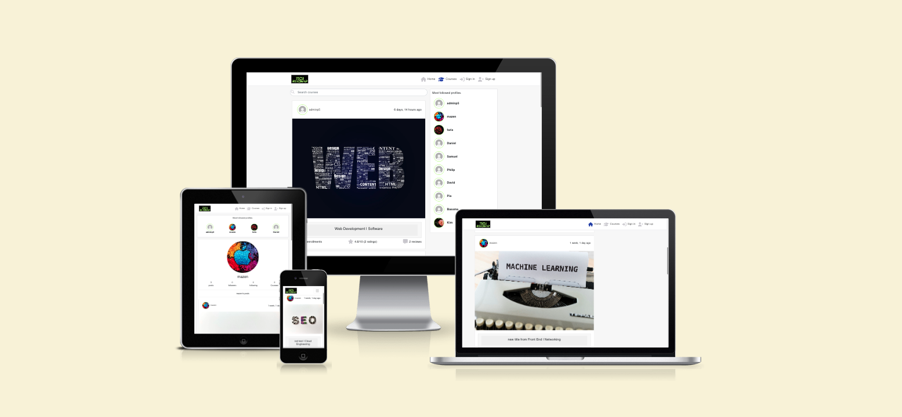

# Tech-Roadmap

Tech-Roadmap is a cutting-edge web platform built to bridge the gap between social interaction and educational growth in the technology sector. Developed with React on the front end and backed by Tech-Roadmap-DRF, the Django REST Framework-based API, this project delivers a seamless user experience that caters to both tech enthusiasts and learners alike.

The primary goal of Tech-Roadmap is to create an interactive space where users can engage in two distinct ways. First, users can post short updates, thoughts, or tips on any tech-related topic—much like you would on Facebook—creating an ongoing exchange of ideas and insights within the community. This social aspect fosters collaboration and knowledge sharing among developers, learners, and tech professionals.

Second, Tech-Roadmap offers a course enrollment feature that mirrors platforms like Udemy. Users can browse through a wide variety of technology-focused courses, enroll in those that interest them, and further their skills in programming, development, and more. Whether you're a beginner looking to learn new tech skills or a seasoned professional sharing your expertise, Tech-Roadmap is designed to support both learning and collaboration.

By combining social interaction with education, the platform aims to empower users to explore new technologies, share their knowledge, and grow within the tech community. Whether you’re here to share, learn, or both, Tech-Roadmap provides a unique space to achieve your goals.

This Front End website makes use of the backend Django-Rest-Framework project which has the following repository [Tech-Roadmap-DRF](https://github.com/AlAliMazen/Tech-Roadmap-DRF) as a source code and the [Tech-Roadmap-DRF](https://tech-roadmap-drf-6a7361986bbb.herokuapp.com/) as deployed version. 

## Author

MAZEN AL ALI


## Project Overview
🚨**Required**

The following screen shot is done by [am-I-responsive](https://ui.dev/amiresponsive)




# Table of Contents
- [Tech-Roadmap](#tech-roadmap)
- [Table of Contents](#table-of-contents)
  * [Author](#author)
  * [Project Overview](#project-overview)
- [UX](#ux)
  * [Target Audience](#target-audience)
    + [Junior Programmers:](#junior-programmers-)
    + [Visitors Interested in IT and Technology](#visitors-interested-in-it-and-technology)
    + [Management and Entrepreneurs](#management-and-entrepreneurs)
  * [Goals](#goals)
    + [Targeted Audience](#targeted-audience)
  * [User Stories](#user-stories)
  * [Initial Stories](#initial-stories)
  * [Feasibility vs Importance](#feasibility-vs-importance)
  * [Scope](#scope)
  * [Design Choices](#design-choices)
    + [Colors](#colors)
    + [Typography](#typography)
    + [Images](#images)
    + [Design Elements](#design-elements)
    + [Animations and Transitions](#animations-and-transitions)
    + [Frameworks](#frameworks)
    + [Custom Styles](#custom-styles)
    + [Custom Javascript](#custom-javascript)
  * [Wireframes](#wireframes)
- [Information Architecture](#information-architecture)
  * [Entity Relationship Diagram](#entity-relationship-diagram)
  * [Database Choice](#database-choice)
  * [Data Models](#data-models)
    + [Activities Model](#activities-model)
    + [CRUD Diagrams](#crud-diagrams)
- [Agile Process](#agile-process)
  * [GitHub User Stories](#github-user-stories)
    + [User Story Templates](#user-story-templates)
    + [Product Backlog](#product-backlog)
  * [Iterations](#iterations)
  * [Progress Boards](#progress-boards)
- [Features](#features)
  * [Implemented Features](#implemented-features)
  * [Future Features](#future-features)
- [Testing](#testing)
  * [Cross Browser and Cross Device Testing](#cross-browser-and-cross-device-testing)
  * [Accessibility Testing](#accessibility-testing)
  * [Validation Testing](#validation-testing)
  * [Automated Testing](#automated-testing)
  * [Defects](#defects)
  * [Defects of Note](#defects-of-note)
    + [Outstanding Defects](#outstanding-defects)
- [E-commerce Business Model](#e-commerce-business-model)
  * [Facebook Business Page](#facebook-business-page)
  * [Newsletter Signup](#newsletter-signup)
  * [Links](#links)
  * [SEO Strategy](#seo-strategy)
    + [Keywords](#keywords)
    + [Description](#description)
    + [Title](#title)
    + [Relevant Content](#relevant-content)
    + [Sitemap](#sitemap)
    + [Robots.txt](#robotstxt)
- [Deployment](#deployment)
  * [Prerequisits](#prerequisits)
  * [Fork and Clone the Repository](#fork-and-clone-the-repository)
  * [Development Deployment](#development-deployment)
  * [Production Deployment](#production-deployment)
- [Credits](#credits)
  * [Content](#content)
  * [Media](#media)
  * [Acknowledgments](#acknowledgments)

<small><i><a href='http://ecotrust-canada.github.io/markdown-toc/'>Table of contents generated with markdown-toc</a></i></small>


====================================== The Sections you Fill in are below ==============================


# UX

Your site is most likely geared to a certain audience and goals for the business owner and users of the site, and your design choices should tie into them. Let the assessors know your thought process.

## Target Audience
🚀 **merit & beyhond**

Targeted Audience
Tech-Roadmap is designed to cater to three main groups, each with unique goals and interests. By providing both technical and social features, the platform serves as a versatile space for learning, sharing, and growing in the tech world.

### Junior Programmers:
The first group is junior developers who are eager to learn and explore the connection between front-end and back-end development. For these users, Tech-Roadmap serves as a practical example of how to integrate modern front-end frameworks like React with a back-end powered by Django REST Framework (DRF). This audience can dig into the codebase, analyze how different components are styled and implemented, and gain valuable hands-on experience in full-stack development. It’s an excellent opportunity for aspiring programmers to see how real-world applications are structured and maintained.

### Visitors Interested in IT and Technology
The second group consists of general visitors who are passionate about IT and technology but may not have a deep programming background. For them, Tech-Roadmap functions as a social platform where they can read engaging posts, stay updated on the latest tech trends, and gain insights into various IT topics. More importantly, these users can also enroll in technology-related courses that align with their interests, similar to popular platforms like Udemy. Whether they want to upskill or just stay informed, this group finds value in both the content shared by the community and the educational resources available on the platform.

### Management and Entrepreneurs
The final group includes management teams or entrepreneurs who are focused on building and scaling social platforms. Tech-Roadmap offers a blueprint for creating a social network that combines educational features with user interaction. This group can observe how a platform can start small, focusing on a niche audience—like the tech and IT community—and grow step by step. For those interested in launching their own social platform, Tech-Roadmap provides an excellent model for combining user engagement, social sharing, and educational content in a scalable way.


## Goals
🚀 **merit & beyhond**

Tech-Roadmap is designed to meet the needs of three key groups, each with distinct goals and interests. The platform offers a blend of technical education, social engagement, and scalability, as well as reusability making it a valuable resource for junior programmers, tech enthusiasts, and management teams.

1. **Junior Programmers**  
   - Gain hands-on experience by studying the integration of front-end and back-end technologies.
   - Learn how to implement and style code in a real-world full-stack project.
   - Understand how different components of a web application communicate with each other.
   - Explore best practices for using React with Django REST Framework to manage data flow and API integration.
   - Develop skills that can be applied to future projects, helping them transition from beginner to intermediate developers.

2. **Visitors Interested in IT and Technology**  
   - Access a social platform where they can read informative posts and learn about trending topics in the IT and tech world.
   - Enroll in technology-related courses to upskill and deepen their understanding of areas like programming, cybersecurity, and data science.
   - Engage with content that is both educational and practical, helping them stay informed in their field of interest.
   - Use the platform as a starting point to discover new technologies and career paths within the IT industry.

3. **Management and Entrepreneurs**  

   - Learn how to launch and scale a social platform from the ground up, targeting a niche community of tech enthusiasts and learners.
   - Observe the integration of social features (posts, likes, comments) with educational content (courses, enrollments), and explore ways to replicate or enhance these features in other platforms.
   - Gain insight into user engagement strategies that blend social interaction with structured learning.
   - Understand how to build a flexible platform that can grow over time, adding new features and expanding the user base step by step.


## Feasibility vs Importance
🚀 **merit & beyhond**

To scope the project for a MVP (minimally viable product) a feasibility analysis was done.

The features in the table below have been taken from the user stories above. Generic features found in most websites
will also be implemented such as nav-bar, footer, obvious website purpose etc.

| Opportunity/Feature | Feasibility/Viability (score out of 5) | PurposeLevel of Importance (score out of 5) | In Or Out |
|---------------------|----------------------------------------|---------------------------------------------|-----------|
|                     |                                        |                                             |           |
|                     |                                        |                                             |           |
|                     |                                        |                                             |           |
|                     |                                        |                                             |           |

> You should discuss the outcome of what you will be dropping based on the outcome. Making a scatter plot of the scores and coloring the dot

## Scope
🚀 **merit & beyhond**

The design implemented in Tech-Roadmap, as reflected in the user stories, serve a dual purpose: they cater to both junior programmers looking to understand front-end development and general visitors engaging with the platform.

1. **For Junior Programmers**:  
   The scope of the design elements extends to demonstrating the integration between front-end React components and back-end API functionalities. Key features such as responsive navigation, card layouts, and icons provide junior developers with practical insights into creating user-friendly interfaces. Additionally, the use of React Bootstrap’s Accordion component and the responsive design principles exemplify how to balance aesthetics with functionality in real-world web applications. These elements help junior programmers understand how to structure and style dynamic content while maintaining seamless user experiences.

2. **For Visitors**:  
   Visitors benefit from the intuitive and interactive design elements, such as collapsible sections for articles and courses, as well as icons that visually indicate key actions like course enrollment, liking articles, and writing reviews. These features enhance the user experience by making the website easy to navigate and visually appealing. The scope here is to engage visitors, whether they are looking for informative content, enrolling in courses, or interacting with the community.

By targeting both junior programmers and regular visitors, the scope of the design elements aligns closely with the user stories, ensuring the platform is not only functional but also educational and engaging.

## Design Choices
🚀 **merit & beyhond**

Now that you have let the assessors know about the target audience and users, you can go into the design choices

### Colors
🚀 **merit & beyhond**

- Discuss your color pallet choices and how it ties into users' emotions or target audience.
- include a screenshot of your pallet using a tool like coolors.co

### Typography
🚀 **merit & beyhond**

- discuss font size, font types for headers vs buttons vs general text and how it ties into users' emotions or target
  audience.
- include screenshots of fonts used and links to the appropriate website ex) https://fonts.google.com/specimen/Raleway

### Images
🚀 **merit & beyhond**

Explain why you used certain icons and images on your site

### Design Elements
🚀 **merit & beyhond**

The design of Tech-Roadmap combines responsiveness, intuitive navigation, and visual elements that enhance user experience across both mobile and desktop platforms. Below are the key design elements used:

1. **Responsive Navigation**: The navigation bar is responsive across devices, adapting to both desktop and mobile views. It provides different options for logged-in users and visitors, ensuring personalized access based on the user’s status.

2. **Container Structure**: A structured container layout is used to hold both articles and courses, providing a clean and organized view. This design keeps content accessible and neatly categorized, improving usability.

3. **Card Elements**: Cards are used to display both article and course content. For articles, the card shows the title and body, while for courses, it reflects the course title and an "About" section, offering a clear and consistent format.

4. **Iconography**: Intuitive icons are used to represent key interactions:
   - **Person Plus/Minus Icons**: Indicate course enrollment and unenrollment actions.
   - **Stars**: Represent user ratings for courses and reviews.
   - **Comment Icon**: Used to show interaction with articles, enabling users to leave comments.
   - **Home Icon**: Directs users back to the homepage for easy navigation.
   - **Hearts**: Represent the like feature, adding a social aspect to article engagement.
   - **Sign-in/Log-out Icons**: Visually distinct icons for logging in and out provide a user-friendly interface for authentication actions.

5. **Accordion Elements**: An accordion component, provided by React Bootstrap, allows users to click on article or course titles to expand and display the full content. This collapsible design conserves space while offering dynamic content viewing options.

These elements together ensure a seamless and engaging user experience, making navigation, interaction, and content consumption intuitive and visually appealing.

### Animations and Transitions
🚀 **merit & beyhond**

Trnasiont and animation was extended from and applied when interacting with:
  - Clicking on action buttons like sign up / sign in / logout 
  - Hover effect applied all over the website including navbar item links and the active item in the menu bar

  - Overlay layout indicating that user can't for example comment on article when he is not logged in.

  - Overlay tipp when trying to enrol twice for the same course, reviewing the course twice or rating twice

  - Auto hide from the notifications 


### Frameworks
🚨**Required**

- Here is a table that explains the frameworks and functions used in developing tech-Roadmap front-end website:

| **Framework/Function** | **Explanation** |
|---|---|
| **React-Bootstrap** | React-Bootstrap is a front-end framework that integrates Bootstrap's responsive design elements into React components. It is used for styling and structuring the website with components like: <br> - **Accordion** for collapsible sections <br> - **Navbar** for responsive navigation <br> - **Cards** for displaying articles and courses <br> - **Container** for organizing layout <br> - **Buttons**, **Images**, **Forms**, and **InputGroup** for UI interactions <br> - **Alert** for displaying error or success messages <br> - **Rows** and **Columns** for responsive grid layouts |
| **Axios** | Axios is a promise-based HTTP client used for making API requests and handling responses. It is useful for: <br> - Fetching data from the backend <br> - Sending POST requests to create or update resources <br> - Handling errors and responses consistently across the application. |
| **React Hooks (useState, useHistory, pathname, useLocation, useMemo, useRef, useEffect)** | React Hooks are functions that let you use state and lifecycle features in functional components. Key functions include: <br> - **useState**: Manages the state of a component <br> - **useHistory**: Provides navigation functionality, allowing you to programmatically change the browser's URL <br> - **pathname** and **useLocation**: Track the current URL path, helping components react to navigation changes <br> - **useMemo**: Optimizes performance by memoizing expensive calculations <br> - **useRef**: Accesses and manipulates DOM elements or store persistent values between renders <br> - **useEffect**: Handles side effects like fetching data, subscriptions, or manually updating the DOM. |
|**React Quill** |Applied to display rich text formatting on the front end. Admins use this to input rich text content through the admin panel, which is then shown to users in a human-readable format. For implementation and how to use it you can visit the [official Quil Documentation](https://quilljs.com/docs/quickstart)|

These frameworks and functions work together to create a responsive, interactive, and performant front-end for the Tech-Roadmap website.

### Custom Styles
🚨**Required**

- call out any overrides you did for bootstrap styles or the framework you used, even if they are fonts and colors,
  perhaps lead assessors to the file of interest in your repo

### Custom Javascript
🚨**Required**

- call attention to any custom javascript you created to help your User Experience you can organize this by functions or
  files

## Wireframes
🚨**Required**

### Wireframes Overview

For developing the wireframes of Tech-Roadmap, I utilized [**Balsamiq**](https://balsamiq.com), a wireframing tool provided through a license from Code Institute. Balsamiq allowed me to create simple, clean, and intuitive layouts that closely resemble the structure used in the walkthrough project from Code Institute. The wireframes serve as a blueprint for how each page in the Tech-Roadmap is laid out.

Below are the wireframes for the following pages:

1. **Home (Article Pages)**: This page showcases the main articles, displaying their titles, summaries, and author details. The layout is clean and focused on readability.


2. **Courses Page**: This page lists the available courses, showing course titles, descriptions, and enrollment count. It highlights features like ratings and reviews count as well to engage visitors.


3. **Adding Category Page**: This page provides a form for adding new categories to the platform. The layout is simple, with input fields and submission buttons.


4. **Adding Article Page**: This page allows logged-in users to write and submit new articles. The wireframe includes fields for title, content, and category selection and image.


5. **Commenting on Article Page**: This page enables users to leave comments on articles. The layout is straightforward, with a comment box and submit button for user interactions.


6. **Add Review to a Course**: This page allows users to submit reviews and ratings for courses they have enrolled in. It includes input areas for rating scores and review text.


The wireframes were designed with simplicity in mind, prioritizing user interaction and ease of navigation. A soft copy of these wireframes can be found in the[ project’s GitHub repository](./README_ASSETS/Tech-roadmap.bmpr) for reference. They helped guide the development process and ensure the final implementation aligned with the planned user experience.


# Information Architecture
As part of the requirements for this project you need to have at **least 3 custom data models**.  It's still under discussion what that means, but I'd make 1 original and then update the products to be custom to what you are selling and create another new one. It's this section that discusses your data and how each piece relates to another and draws out the CRUD functionality you built. You must have CREATE, READ, UPDATE & DELETE for at least one model.

## Entity Relationship Diagram
🚨**Required**

Wade Williams wrote a great blog about how to add a django extension to auto create an ERD. https://wadewilliams.com/technology-software/generating-erd-for-django-applications/ You can always draw one out by hand or google sheets. You can also draw this up by hand if you want or use a spreadsheet to show your data model.

## Database Choice
🚀 **merit & beyhond**

Just state you used postgres as the database because the data is relational and heroku serves this up realitvely easily with no cost.

## Data Models
🚨**Required**

Show the accessors you know your data. If you end up using some data models from an example project, call that out and don't be as detailed about writing those up unless you added to them.

Each data model that you created yourself should have its Fields, Field Type and any validation documented.  You should also cross-reference any code in your repository that relate to CREATE, READ, UPDATE, DELETE operations for these models.

*Below is an example of a write up for an Activities Data Model*

> ### Activities Model
> Activities is a table to hold a unique icon image and name values that users have associated with events and places. It helps with sorting events and prevents the need from carrying around two data objects in the larger Events and Places data structures. The purpose of an Activities object is to provide an imagery association to a category.
> 
> | DB Key 	| Data Type 	|          Purpose          	| Form Validation                        	| DB processing    	|
> |--------	|:---------:	|:-------------------------:	|----------------------------------------	|------------------	|
> | _id    	| ObjectId  	| unique identifier         	| None                                   	| n/a              	|
> | name   	| String    	| Name of Activity          	| Required<br>Min 1 char<br>Max 50 chars 	| trim<br>to lower 	|
> | icon   	| String    	| system path to image file 	| Required                               	|                  	|
> 
> Activity entries are used by events, places and filtering.
> 
> - [x] Create - An activity is potentially created when a user successfully creates a place, creates an event, updates an event, or updates a place.
> - [x] Read - The Activities table is read when a user is adding an event, updating an event, adding a place or updating a place, to determine if a new value should be created or not. The activities table is queried for using the name and icon pair, if it is found, the ObjectId is passed to the event and places. If no match is found, a new Activity is created and that ObjectID is passed to the the place or event.
> - [ ] Update
> - [ ] Delete
> 
>  This table has no deletion or updates associated with it. It's strictly create and read. Eventually, maintenance scripts should be written to delete unused/deprecated entries.

> The reading/writing of the activities table is housed in the [what2do2day/activities/views.py](what2do2day/activities/views.py) file.

### CRUD Diagrams
🚀 **merit & beyhond**

This is if you want to go for distinction.  You can also have CRUD diagrams to show them visually how the model is used in your site.

I used [draw.io](https://app.diagrams.net/) and hooked it up to my google drive to create the screenshot below


# Agile Process

## GitHub User Stories
🚨**Required**

As Version Control System Github doesn't only provide the ability to track chnages to the project files, but also it provides the possibility to create and track the implementation to the user stories which represent the goals and feature to be implemented in the website.

### User Story Templates
🚨**Required**

### User Stories Overview

In Agile development, **user stories** are a critical way to define features from the perspective of the end-user. They help the team focus on delivering value incrementally while staying connected to user needs. These user stories are grouped into **normal stories**—specific 
and actionable tasks—and **Epic stories**, which represent larger goals or overarching functionality that may span several development sprints.

For a detailed breakdown and tracking, I have created a comprehensive list of user stories, available through the following [Tech-Roadmap](https://github.com/users/AlAliMazen/projects/6/views/1).

---

### Epic Stories

1. **User Management**: As a user, I can create, manage my account, including my contributions such as articles, comments, and enrollments, to fully control my presence on the platform.
   
2. **Course Interaction**: As a user, I can browse, filter, and enroll in courses, as well as leave reviews and ratings, to enhance my learning journey on the platform.

3. **Article Engagement**: As a user, I can explore, write, comment, and interact with articles, facilitating knowledge sharing and discussions within the community.

---

### Normal User Stories

- **User Profile**
  1. As a visitor, I can retrieve all available user profiles.
  2. As a user, I can view a specific user profile to see how many articles they have written and likes as well as follower and contributions.
  

- **Account Management**
  1. As a visitor, I can create an account to participate in writing articles and commenting.
  2. As a user, I can log in and out to manage my access and security.
  
- **Articles**
  1. As a visitor, I can retrieve all articles to read useful content on IT and technology.
  2. As a logged-in user, I can write an article to share my knowledge with the community.
  3. As a logged-in user, I can comment on articles to engage in discussions.
  4. As a visitor, I can view article details, including who wrote them and when.
  
- **Courses**
  1. As a visitor, I can view all available courses.
  2. As a logged-in user, I can enroll in a course to read more about the course features.
  3. As a user, I can filter courses to find relevant content.
  4. As a logged-in user, I can leave a review and rating for a course I am enrolled in.

- **Likes and Followers**
  1. As a logged-in user, I can like articles to show my appreciation.
  2. As a logged-in user, I can follow other users to stay updated on their contributions.


- **Admin Features**
  1. As an admin, I can create new courses to provide learning materials for users from **ADMIN PANEL**.

For the templates which has been followed for creating both Epic and Normal User Storeis your can check [Tech-Roadmap-Project](https://github.com/AlAliMazen/tech-roadmap/issues/new/choose)

**What to keep in this section**

- include links and/or screenshots of your story template(s)

### Product Backlog
🚨**Required**

https://learn.codeinstitute.net/courses/course-v1:CodeInstitute+AG101+2021_T1/courseware/a4e548ca70a3473aa890ba2ab9bf612c/085f3a8e344a4cf28b5b5355399abcc1/?child=last
This is the MILESTONE where you grab stories from the issues or USER stories you created and prioritize them and order
them, leave the epics out.

**What to keep in this section**
Include a link to your Product Catalog Milestone,

an initial screenshot, mid-point and final will help document the agile process.

## Iterations
🚀 **merit & beyhond**

https://learn.codeinstitute.net/courses/course-v1:CodeInstitute+AG101+2021_T1/courseware/a4e548ca70a3473aa890ba2ab9bf612c/71fe6c52cccf477688e924c9889f5fec/?child=first

Add links to iteration milestones (most people have ONE iteration since they are the solo worker, just state that here),
it could be that you won't have all your product backlog worked in the end, and that is ok, hte MVP might morph, you
might find other stories you want instead, it's OK.

## Progress Boards
🚀 **merit & beyhond**

https://learn.codeinstitute.net/courses/course-v1:CodeInstitute+AG101+2021_T1/courseware/a4e548ca70a3473aa890ba2ab9bf612c/7ad7f487cc6148ecb182d77feaeda269/?child=first
Add links to Progress boards

# Features
🚨**Required**

Here’s a more detailed explanation of the website's features based on the user stories:

### 1. **Navigation Bar**
- **Feature**: The navigation bar is present across all pages of the website and acts as the main hub for accessing key features. 
- **Explanation**: Logged-in users will see options to add categories and write articles, whereas visitors will see limited options, ensuring that the functionality is tailored based on user roles. This enhances user experience by providing quick access to relevant actions.

### 2. **Sign-Up and Logout**
- **Feature**: Users can sign up for an account or log out once they’re logged in.
- **Explanation**: Signing up allows users to participate in more advanced actions, such as writing articles, commenting, and enrolling in courses. The logout functionality ensures users can securely exit their accounts when finished.

### 3. **Home Page**
- **Feature**: The home page serves as the main content area, featuring a list of articles that include the author’s name and publication date.
- **Explanation**: Visitors can explore various topics, and by clicking on the article title, they can read the full content. This design provides transparency about who wrote each article and when it was published, adding trust and context for the reader.

### 4. **Article Comments**
- **Feature**: Logged-in users can leave comments on articles.
- **Explanation**: This feature allows users to engage in discussions, ask questions, or provide feedback directly under an article, promoting community interaction and dynamic discussions around specific topics.

### 5. **Course Enrollment**
- **Feature**: Users can enroll in courses created by admins.
- **Explanation**: The enrollment feature enables users to access educational content directly through the platform. Users can easily enroll in various courses, enhancing the site's value as an educational resource.

### 6. **Course Reviews and Ratings**
- **Feature**: Each course displays reviews, ratings, and the number of enrollments.
- **Explanation**: Users can view feedback from other learners before deciding whether to enroll. This feature helps users make informed decisions based on the quality and popularity of the courses, similar to platforms like Udemy.

### 7. **Most Followed Profiles**
- **Feature**: A section on the website highlights the most followed profiles.
- **Explanation**: Showcasing popular users promotes influential members within the community, giving users an idea of whom to follow and helping them discover content creators with valuable insights.

### 8. **Profile Pages**
- **Feature**: Each user has a separate profile page displaying their personal details, articles, and other contributions.
- **Explanation**: This feature allows visitors and users to learn more about individual members, such as their content, interests, and community engagement. It encourages networking and content discovery.

### 9. **No Result Page**
- **Feature**: A “No Result” page is displayed when users navigate to an invalid or non-existent URL.
- **Explanation**: This feature enhances user experience by providing clear feedback that the page doesn’t exist, redirecting users to the correct paths rather than leaving them in confusion or frustration.

### 10. **Filtering**
- **Feature**: Users can filter both articles and courses to find specific content.
- **Explanation**: Filters provide an efficient way to navigate large amounts of content. Whether a user is searching for a particular course in a specific field or articles on a certain topic, the filtering feature saves time and offers personalized browsing.

### 11. **Write Reviews**
- **Feature**: Logged-in users can write reviews for the courses they are enrolled in.
- **Explanation**: This allows users to give detailed feedback on the course material, the instructor’s teaching style, or any other elements they found useful or lacking. Reviews enrich the course catalog by offering insight from past learners.


## Future Features
🚀 **merit & beyhond**

### Future Features

1. **User Profile Deletion**: In future updates, users will have the ability to delete their own profiles. This action will also remove all associated content, including articles, comments, enrollments, and any other form of participation. Ensuring that all user-generated data is appropriately deleted will maintain database integrity and privacy.

2. **"My Courses" Section**: A dedicated "My Courses" page will be introduced to provide users with a personalized view of the courses they are enrolled in. This feature will offer easy access to ongoing or completed courses, enhancing the learning experience and improving course management for users.

3. **Course Creation for Admins**: Currently, only website administrators can create courses through the admin panel. A future enhancement will involve adding a dedicated course creation page for administrators, streamlining the process and making it easier to manage and publish new courses for visitors and enrolled users.

These future features will expand the platform’s functionality, improve user experience, and provide greater control and customization for both users and administrators.

# Testing
🚨**Required**

In this section, you need to convince the assessor that you have conducted enough testing to legitimately believe that
the site works well. Essentially, in this part you will want to go over all of your user stories from the UX section and
ensure that they all work as intended, with the project providing an easy and straightforward way for the users to
achieve their goals.


**At this point, you should use gitHub Issues Templates and Test Case** to track test cases and defects. Here's
a [document](https://docs.google.com/document/d/1nDS5tZeMO77Dfq85IZGMSV6C41XaPm9FwcpR3k-UTVc/edit#heading=h.3kdbr3tqbzi)
I put together for this process.

You should make sure your test cases cover the following: 
## Cross Browser and Cross Device Testing
🚨**Required**

To save time, you can create this type of table
in [markdown table generator](https://www.tablesgenerator.com/markdown_tables)

As of Feb 14, 2022 CI students can take advantage of the Student Developer Pack where you have access to great things
like [browserstack](https://education.github.com/pack/offers/#browserstack) You should have received an email about how
to activate your student Developer Pack, here's
a [slack](https://code-institute-room.slack.com/archives/C0L316Z96/p1644946870567999) with details if you can't find it
in the associated thread.

Start with a brief explanation of why you chose the mixture you did. The point is to prove that you looked at the site
across various browsers, operating systems, and viewport breakpoints. You can add a column about the spot checking path
you took or write it out here:

1. Visit https://gs.statcounter.com/browser-market-share to figure out the most popular browsers & operating system combos seen across the we for the geographic region, and platoform(s) and screen sizes you expect your users to belong to. 

1. Include a sentence about why you chose the combinations you did.

1. Create a table that lists out what devices, browsers, and operating system you tested your application on and a brief description of why you chose the mixture you did. The point is to prove that you looked at the site across various browsers, operating systems, and viewport breakpoints.

1. if you can't find the brower/device/OS combinations you want on Browserstack with your github student webpack (or you didn't activate that in time), note what you'd ideally test on then what you ended up testing on as a compromise. 

> **Example:**
> To ensure the code was functional and looked good on varoius devices I tested a couple of generic flows though my site on using the following Tool/Device combinations. The device/browser/and OS combinations were used based on reports found at [browser market share](https://gs.statcounter.com/browser-market-share) taken on MM/DD/YYYY:
>
> | TOOL / Device                 | BROWSER     | OS         | SCREEN WIDTH  |
> |-------------------------------|-------------|------------|---------------|
> | real phone: motog6            | chrome      | android    | XS 360 x 640  |
> | browser stack: iPhone5s       | safari      | iOs        | XS 320 x 568  |
> | dev tools emulator: pixel 2   | firefox     | android    | SM 411 x 731  |
> | browserstack: iPhone 10x      | Chrome      | iOs        | SM 375 x 812  |
> | browserstack: nexus 7 - vert  | Chrome      | android    | M 600 x 960   |
> | real tablet: ipad mini - vert | safari      | iOs        | M 768 x 1024  |
> | browserstack: nexus 7 - horiz | firefox     | android    | LG 960 x 600  |
> | chrome emulator: ipad - horiz | safari      | iOs        | LG 1024 x 768 |
> | browserstack                  | Chrome      | windows    | XL 1920 x 946 |
> | real computer: mac book pro   | safari 12.1 | Mohave     | XL 1400 x 766 |
> | browserstack                  | IE Edge 88  | windows 10 | XL 1920 x 964 |
>
> Here is a link to the [test case](https://github.com/maliahavlicek/ci_mentor_insights/issues/9).

Note, you might find it easier to create a test case for each tool/device and link to the test case in the table here.

## Accessibility Testing
🚨**Required**

You should have test cases for accessibility and links to them here. Start with a brief paragraph and then link to the
test cases. If you are ambitious you can record the screen of you using the keyboard, convert it to a gif and upload it
to the test case too.

**example**
> To ensure that the site was accessible to people with visual impairments, I used chrome's dev tools, lighthouse audits to ensure I had a score in the green for accessibility and that I could keyboard navigate through the page.
>
> Here are links to the test cases for each which contains the screenshot for the lighthouse audit.
> - [home page accessibility test](https://github.com/maliahavlicek/ci_mentor_insights/issues/12)
> - [experience page accessibility test](https://github.com/maliahavlicek/ci_mentor_insights/issues/13)
> - [skills page accessibility test](https://github.com/maliahavlicek/ci_mentor_insights/issues/14)
> - [recommendations page accessibility test](https://github.com/maliahavlicek/ci_mentor_insights/issues/15)
>
> To ensure the site was accessibility to people with physical impairments, I tried to navigate the site using tabbed navigation:
> - [site tabbed navigation test](https://github.com/maliahavlicek/ci_mentor_insights/issues/10)

You can totally combine the tabbed navigation in the accessibility test and have 2 expected criteria, it's all up to
you!

## Validation Testing
🚨**Required**

You should try to ensure you code is valid and follows proper indentation. In this section you should write up any
websites you used to validate your code so there is credit given to those sites. Then add links to the test cases you
put into GitHub for the validation. You can copy your validation success to those tests.

The following site were used to aid in validation testing:

- **[CSS Validator](https://jigsaw.w3.org/css-validator/)**

> If you only have one CSS file, you can just run the validator through one deployed page URL, if you have custom CSS for diffent pages, make sure you hit those different URLS

- **[HTML Validator](https://validator.w3.org/)**

> For each view you wrote, you should validate the HTML and have a test case for it linked to from here
> NOTE: You may need to right-click to view the source of each page and paste that into the validator if you need to go through authentication to get to the page.

- **[JS validation](https://jshint.com)**

> for each .js file, copy the code and paste it into this site, and have a test case for it linked to from here. You can have warnings, but no errors.
> if using ES6, add this before pasting in your file: `/*jshint esversion: 6 */ `, similarily you can update it to 7 if you see warnings about ES7 syntax `/*jshint esversion: 7 */ `

- **[CI's pep8 tool](https://pep8ci.herokuapp.com/)** 

> for each .py file you created, copy the source code and paste it into this site, and have a test case for it linked to from here.
> include a screenshot of results in the test case showing NO ERRORS. (you should do this for all .py files in your repo)
> 
> **run.py**
> 
> 

> Ideally you would have no errors remaining outside of line too long which you can fix by 
> 
> adding
> ```$python 
> # noqa
> ```
> There is a space before the # and after it to skip the quality assurance for that line.
> 
> Note any errors or warnings you are ignoring and why.

- **[JSON validation](https://jsonlint.com/)**

> for each .json file, you should copy the code and paste it into this site, and have a test case for it linked to from here.

## Automated Testing
🚀 **merit & beyhond**

**NOTE: If you want MERIT or Higher, you MUST have some automated testing**
If you managed to write jasmine tests or some django tests, note those files out here and how to run them.

https://github.com/maliahavlicek/ms4_challenger/blob/master/documentation/TESTING.md is my write up about my automated testing and how I ran them, but a simple test I'd recommend is a views test that tests authentication and any views you limit to superusers or logged in users.

https://github.com/maliahavlicek/ms4_challenger/blob/master/challenges/tests/test_views.py

## Defects
🚨**Required**

At this point you really should be using GITHUB's Issues to track these as it helps you with the AGILE process
requirement as it's really easy to copy/paste screenshots in and then write up how you closed them.

[Here's a brief overview](https://docs.google.com/document/d/1nDS5tZeMO77Dfq85IZGMSV6C41XaPm9FwcpR3k-UTVc/edit#heading=h.542xzc8ufx4x)
I put together on how to do this.

is what my custom tempalte looks like in the UX


## Defects of Note
🚀 **merit & beyhond**

Some defects are more pesky than others. Highlight 3-5 of the bugs that drove you the most nuts and how you finally
ended up resolving them. Just create a link to the issues/defect of note.

### Outstanding Defects

It's ok to not resolve all the defects you found. If you know of something that isn't quite right, list it out and
explain why you chose not to resolve it. Again, do this in gitHub and provide a link to the defects you are not closing
and ensure they have a comment in them.

## Development Deployment 
🚨**Required** 

This section should describe the process someone would have to go through to get the local working in GitPod, or your preferred IDE. Start from installing the chrome extension then clicking the green gitpod button in THEIR FORKED repository, the enumerate the steps to walk them through the process as if they were brand new to this proccess. **Include screenshots** where applicable.

**Key points to cover** 
- Install required python packages: `pip3 install -r requirements.txt`
- Create env.py
- What to put in the env.py, don’t disclose real values
>  - EMAIL_HOST_PASSWORD=<YOUR_VALUE>
>  - DEFAULT_FROM_EMAIL=<YOUR_VALUE>
>  - EMAIL_USERNAME=<YOUR_VALUE>
>  - SECRET_KEY=<YOUR_VALUE>
>  - CLOUDINARY_URL=<YOUR_VALUE>
>  - DEV=True
- Apply Database Migrations so the database starts up `python3 manage.py migrate`
- Create a super user so you can add and inspect things via django admin  `python3 manage.py createsuperuser`
- Preload data: Sometimes you might want to include steps to create data in the admin or preload a data dump [coderwall blog](https://coderwall.com/p/mvsoyg/django-dumpdata-and-loaddata) has examples on how to dump data and load it which saves a bunch of time when deploying the application from a local database to a hosted database but you don’t  have to do this step
- Start the server `python3 manage.py runserver`


## Production Deployment
🚨**Required** 

This section should describe the process you went through to deploy the project to a server where anyone can access the url without your machine running. This is typically Heroku. **Include screenshots** if you think they would make the process easier. Start with getting an heroku account and then setting up databases and other packages.

If you have project settings required for Heroku, provide a table of the keys and values. Do not share your personal
keys but either cut them out of the screenshot or say <YOUR_VALUE> and include links on how the user would obtain such
values.

**Key points to cover** 
- cerating new app
- setting app name
- setting region
- entering dreaded billing info
- subscribing to a plan
- setting up db
- adding environmental values- have a list or table so user has less chance of typos
>  - EMAIL_HOST_PASSWORD
>  - DEFAULT_FROM_EMAIL
>  - EMAIL_USERNAME
>  - SECRET_KEY
>  - CLOUDINARY_URL
>  - COLLECT_STATIC
- adding build packages
- deploy
- gitHub connection
- auto vs manul deploy
- monotior logs


# Credits
🚨**Required**

To avoid plagiarism amd copyright infringement, you should mention any other projects, stackoverflow, videos, blogs, etc that you used to gather imagery or ideas for your code even if you used it as a starting point and modified things. Giving credit to other people's efforts and ideas that saved you time acknowledges the hard work others did.

-[Code Institute Template](https://github.com/Code-Institute-Org/python-essentials-template)
    - The Template for the GUI for this project was provided by Code Institute. This allows for the Command line to be shown and used within the browser.

## Content

Use bullet points to list out sites you copied text from and cross-reference where those show up on your site

## Media

Make a list of sites you used images from. If you used several sites try to match up each image to the correct site. This includes attribution for icons if they came from font awesome or other sites, give them credit.

## Acknowledgments

This is the section where you refer to code examples, mentors, blogs, stack overflow answers and videos that helped you accomplish your end project. Even if it's an idea that you updated you should note the site and why it was important to your completed project.

If you used a CodeInstitute Instructional project as a starting point. Make note of that here too.

